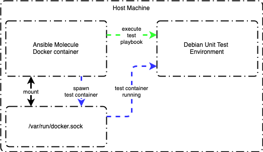

Ansible Role Jupyter Notebook
=========

This role builds Jupyter Notebook for Debian, and RedHat OS families. It can be applied for container images, virtual machine images, or directly against a host.

ToDo's
---------------

1. Add logic for Alpine OS family

1. Testing configuration created to use Molecule.

Role Variables
----------------

Ansible variable is listed below, along with defualt value (see defaults/main.yml):

```ansible
container_iamge_builder: false
```

Dependencies
------------

None identified at this time.

Example Playbook
----------------

```ansible
- hosts: servers
  roles:
     - jupyter-notebook
```

Testing Role
----------------

The ansible molecule container needs to mount the host machine's /var/run/docker.sock to have the ability to spawn another container representing the environment to unit test the role in. Once the environment container is running, then the molecule container will connect to the test environment container to run the test ansible playbook.



Example docker command to run molecule:

```ansible
docker run --rm -it \
    --env MOLECULE_NO_LOG="false" \
    -v "$(pwd)":/tmp/$(basename "${PWD}"):ro \
    -v /var/run/docker.sock:/var/run/docker.sock \
    -v ~/.ssh:/root/.ssh \
    -w /tmp/$(basename "${PWD}") \
    quay.io/ansible/molecule:3.0.4 \
    molecule test
```

License
-------

[GPLv3](LICENSE)

References
----------

- [Yamllint](https://yamllint.readthedocs.io/en/latest/)
- [Molecule Docker Configuration](https://molecule.readthedocs.io/en/2.22/configuration.html#docker)
