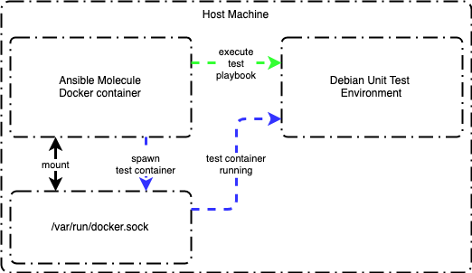

Role Name
=========

Description of the role.

ToDo's
---------------

1. Any ToDo's for a future release

Dependencies
------------

None.

Example Playbook
----------------

Including an example of how to use the role in a playbook:

```ansible
- hosts: servers
  roles:
    - my-cool-role
```

Testing Role
----------------

The ansible molecule container needs to mount the host machine's /var/run/docker.sock to have the ability to spawn another container representing the environment to unit test the role in. Once the environment container is running, then the molecule container will connect to the test environment container to run the test ansible playbook.



Example docker command to run molecule:

```ansible
docker run --rm -it \
    --env MOLECULE_NO_LOG="false" \
    -v "$(pwd)":/tmp/$(basename "${PWD}"):ro \
    -v /var/run/docker.sock:/var/run/docker.sock \
    -v ~/.ssh:/root/.ssh \
    -w /tmp/$(basename "${PWD}") \
    quay.io/ansible/molecule:3.0.4 \
    molecule test
```

License
-------

[Apache 2](LICENSE)

References
----------

- [Yamllint](https://yamllint.readthedocs.io/en/latest/)
- [Molecule Docker Configuration](https://molecule.readthedocs.io/en/2.22/configuration.html#docker)
- [Systemd Container](https://molecule.readthedocs.io/en/latest/examples.html#systemd-container)
